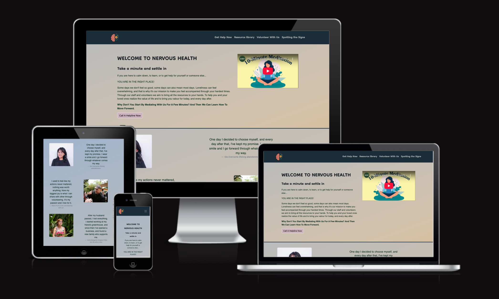

## 🚀 Live Website
# Nervous Health

A mental health awareness resource site built as a **Code Institute** school project. It blends researched content with personal insight to create a realistic, calming, and supportive experience.

[Am I Responsive](assets/images/amiresp.png)

---

## 🚀 Live Website
**URL:** _Add your deployed link here (e.g., GitHub Pages / Netlify / Vercel)_

---

## 📑 Table of Contents
1. [About](#about)
2. [User Stories](#user-stories)
3. [UX Design](#ux-design)
4. [Features](#features)
5. [Deployment & Dependencies](#deployment--dependencies)
6. [AI Implementation](#ai-implementation)
7. [Testing & Validation](#testing--validation)
8. [References / External Links](#references--external-links)
9. [Credits](#credits)
10. [License](#license)

---

## About
**Nervous Health** aims to offer a **calming landing page**, clear crisis support, and a resource library tailored to different **mental health topics** and **learning styles**. It reflects some **personal experiences** and strives to be **realistic and immersive** to help visitors who may be struggling. A prominent “**Call a Helpline**” action is available site-wide, including **UK emergency numbers** and a link to **international helplines**.

---

## User Stories

### 1) Immediate Crisis Access
- **As a** visitor in crisis
- **I want** a visible “Get Help Now” button that opens a modal with UK numbers and an international helpline list
- **So that** I can get urgent support fast
- **Acceptance Criteria**
    - “Get Help Now” present in navbar and footer
    - Modal shows UK: **999 / 112** and a link to international helplines
    - Works on mobile and desktop

### 2) Learn the Signs
- **As a** caring friend/family member
- **I want** guidance on spotting depression/mental health issues and how to support next steps
- **So that** I can help effectively
- **Acceptance Criteria**
    - Clear sections: **Spotting the Signs**, **How to Help**, **What to Do Next**
    - Plain, empathetic language
    - Accessible layout with headings and cards

### 3) Explore the Resource Library
- **As a** learner with different preferences
- **I want** curated organizations, experts, and formats (articles, videos, therapy links)
- **So that** I can find a resource that matches my needs
- **Acceptance Criteria**
    - Cards with image, title, short blurb, and external link
    - Content spans multiple topics and styles

### 4) Volunteer With Us
- **As a** community member
- **I want** a simple form to express interest in volunteering
- **So that** I can contribute and connect
- **Acceptance Criteria**
    - Form fields for name, email, location, short bio/motivation
    - Optional newsletter/updates opt-ins
    - Submit button with basic validation

### 5) Stay Informed
- **As a** returning visitor
- **I want** an email subscription box
- **So that** I can receive periodic tips and updates
- **Acceptance Criteria**
    - Footer form to add email
    - Clear consent language and no spam promise

---

## UX Design
- **Tone & Goal:** Calm, reassuring, supportive.
- **Landing Experience:** Hero copy that invites visitors to breathe and settle; embedded **10-minute meditation video** (YouTube) to reduce anxiety.
- **Information Architecture:** Primary nav links to **Resource Library**, **Volunteer**, **Spotting the Signs**, and crisis support.
- **Accessibility:** Semantic HTML, alt text for images, large touch targets for the helpline button, and simple language.
- **Branding:** Minimalist look with soft gradients, modern typography (**Google Fonts:** Dongle & M PLUS 1p).

---

## Features
- **Global Crisis Support**
    - “Get Help Now” button and footer **Call a Helpline** action
    - UK emergency prompt and international list link
- **Resource Library**
    - Curated cards (people, orgs, services) with clear calls to action
- **Education Section – “Spotting the Signs”**
    - Three-card layout: recognize signs, offer support, next steps
- **Volunteer Form**
    - Inputs for name/email/location/motivation; optional opt-ins
- **Newsletter Signup (Footer)**
    - Monthly updates and community highlights
- **Responsive & Mobile-First**
    - Bootstrap grid/components; custom CSS
- **Meta & Favicons**
    - Description tag; Apple touch & PNG favicons

---

## Deployment & Dependencies
- **Bootstrap 5** via CDN
- **Google Fonts:** Dongle, M PLUS 1p
- **Font Awesome** (kit)
- **Custom CSS:** `assets/css/style.css`
- **Favicons:** `assets/images/*`
- **Recommended Deployment:** GitHub Pages / Netlify / Vercel
- **How to Deploy (example: GitHub Pages)**
    1. Push this repo to GitHub
    2. In **Settings → Pages**, set the branch to `main` (root)
    3. Wait for build → use the provided URL
- **Environment:** Static site; no server-side code

---

## AI Implementation
- **Content & UX Copy:** Sections and micro-copy drafted with assistance to ensure clarity and empathy.
- **Design Assets:** Optional custom favicon/icon set (brain & flowers) prepared for future use.

---

## Testing & Validation
- **Manual Testing**
    - Check navbar, page routing, helpline modal, forms, and external links on desktop & mobile
- **Validators**
    - HTML Validator (W3C), CSS Validator, and **Lighthouse** for performance/a11y/SEO
- **Accessibility**
    - Keyboard navigation, focus states, alt text, color contrast
- **Known Issues**
    - Add after testing (e.g., embed responsiveness tweaks, form validation messages)

---

## References / External Links
- **International Crisis Lines:** https://en.wikipedia.org/wiki/List_of_suicide_crisis_lines#Crisis_lines_by_country
- **Organizations & Resources (examples):**
    - Gottman Institute — https://www.gottman.com/
    - Sabrina Zohar — https://www.youtube.com/@Sabrina_zohar/featured
    - Mind — https://www.mind.org.uk/
    - NHS Mental Health — https://www.nhs.uk/mental-health/
    - Verywell Mind — https://www.verywellmind.com/therapy-4581775
    - Talkspace — https://www.talkspace.com/
    - The School of Life — https://www.theschooloflife.com/
    - Thriveworks — https://thriveworks.com/

---

## Credits
- **Educational Context:** Code Institute project
- **Frameworks & Assets:** Bootstrap, Google Fonts, Font Awesome
- **Images:** Local `/assets/images/` and open resources as credited in the site
- **Disclaimer:** “Nervous Health is a fake entity…” copy included in footer to clarify non-clinical status

---

## License
This project includes components under the **MIT License** (HTML5 Boilerplate). See [`LICENSE.txt`](LICENSE.txt) for details.

- Acknowledge external libraries, icons, or tutorials.
- Mental health websites
- https://www.centreformentalhealth.org.uk/topics/economics/
-  https://en.wikipedia.org/wiki/List_of_suicide_crisis_lines
- fonts
-  https://fontawesome.com/search?c=medical-health&o=r
- gradient background
-  https://www.youtube.com/watch?v=O-6f5wQXSu8&t=1s
-  https://www.gradient-animator.com/
- Icons by GPT-5
Photos
-
- Photo by Ahmet Yüksek ✪: https://www.pexels.com/photo/layered-mountain-silhouettes-at-sunset-33764947/
-  Photo by Đỗ Ngọc Tú Quyên: https://www.pexels.com/photo/photo-of-a-woman-smiling-1520760/
-  Photo by Justin Shaifer: https://www.pexels.com/photo/photography-of-a-guy-wearing-green-shirt-1222271/
-  Photo by Tima Miroshnichenko: https://www.pexels.com/photo/people-arms-raised-with-clenched-fist-7203649/
-  Photo by Thiago  Matos : https://www.pexels.com/photo/woman-with-smeared-eyes-in-studio-4576085/
-  Photo by Yassir Abbas: https://www.pexels.com/photo/man-with-eyes-covered-by-cloth-11611449/
-  Photo by Tara Winstead: https://www.pexels.com/photo/red-text-on-white-textile-8386730/
-  Photo by Bri Schneiter: https://www.pexels.com/photo/calm-body-of-lake-between-mountains-346529/
-  Photo by <a href="https://unsplash.com/@g_leighton?utm_content=creditCopyText&utm_medium=referral&utm_source=unsplash">Gustavo Leighton</a> on <a href="https://unsplash.com/photos/woman-holding-a-potted-pink-flower-among-lush-green-plants-LfOHw9tO58k?utm_content=creditCopyText&utm_medium=referral&utm_source=unsplash">Unsplash</a>
-  Photo by <a href="https://unsplash.com/@withdanial?utm_content=creditCopyText&utm_medium=referral&utm_source=unsplash">Danial D</a> on <a href="https://unsplash.com/photos/man-in-black-shirt-and-cap-gestures-enthusiastically-VBpMICi4Z74?utm_content=creditCopyText&utm_medium=referral&utm_source=unsplash">Unsplash</a>
-  Photo by <a href="https://unsplash.com/@jonathanborba?utm_content=creditCopyText&utm_medium=referral&utm_source=unsplash">Jonathan Borba</a> on <a href="https://unsplash.com/photos/people-swimming-and-enjoying-the-ocean-on-a-sunny-day-NgWfv952yls?utm_content=creditCopyText&utm_medium=referral&utm_source=unsplash">Unsplash</a>

---
